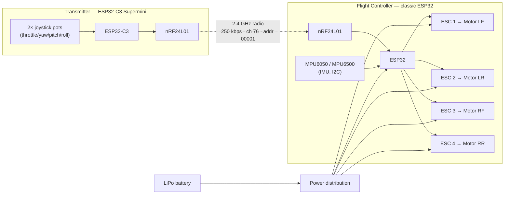
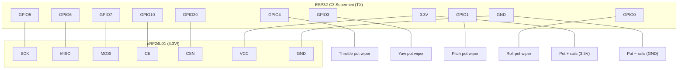
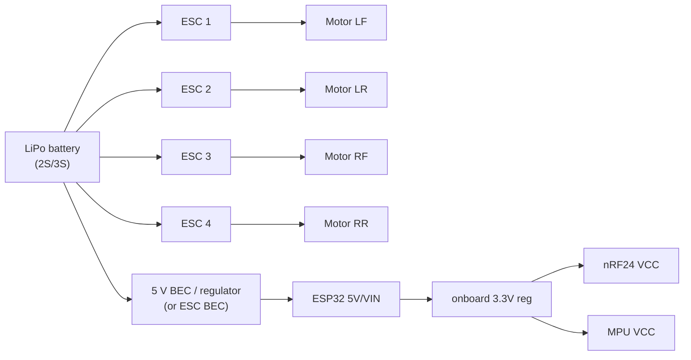

# Wiring & Connection Diagram

Complete connections for the **VTOL KAMIKAZE** two‑board ESP32 quadcopter.
All pin numbers are taken straight from the firmware
([`drone_fc/drone_fc.ino`](../drone_fc/drone_fc.ino),
[`drone_tx/drone_tx.ino`](../drone_tx/drone_tx.ino)) — keep them in sync.

> ⚠️ **Power rules:** the nRF24L01 and MPU6050 are **3.3 V only** — 5 V will
> destroy them. Always test with **propellers OFF**.

---

## 1. System overview



---

## 2. Flight Controller (classic ESP32) — receiver

### 2.1 Connection table

| ESP32 pin | Connects to | Notes |
|-----------|-------------|-------|
| **GPIO4**  | nRF24 **CE**   | radio chip-enable |
| **GPIO5**  | nRF24 **CSN**  | radio SPI chip-select |
| **GPIO18** | nRF24 **SCK**  | default VSPI clock |
| **GPIO19** | nRF24 **MISO** | default VSPI (radio → ESP) |
| **GPIO23** | nRF24 **MOSI** | default VSPI (ESP → radio) |
| **3.3 V**  | nRF24 **VCC**  | **never 5 V**; add a 10–100 µF cap across VCC/GND |
| **GND**    | nRF24 **GND**  | common ground |
| **GPIO21** | MPU **SDA**    | I2C data |
| **GPIO22** | MPU **SCL**    | I2C clock |
| **3.3 V**  | MPU **VCC**    | 3.3 V |
| **GND**    | MPU **GND** + MPU **AD0** | AD0→GND sets I2C address `0x68` |
| **GPIO14** | ESC 1 signal   | **Left-Front** motor |
| **GPIO27** | ESC 2 signal   | **Left-Rear** motor |
| **GPIO26** | ESC 3 signal   | **Right-Front** motor |
| **GPIO25** | ESC 4 signal   | **Right-Rear** motor |
| **GND**    | all 4 ESC grounds | ESC signal grounds must share ESP32 GND |

> The four ESCs take their **motor power from the battery**, not from the ESP32.
> Only the ESC **signal** wire (and its ground) go to the ESP32.

### 2.2 FC diagram

```mermaid
flowchart TB
    subgraph ESP["Classic ESP32 (FC)"]
        direction TB
        G4["GPIO4"]; G5["GPIO5"]; G18["GPIO18"]; G19["GPIO19"]; G23["GPIO23"]
        G21["GPIO21"]; G22["GPIO22"]
        G14["GPIO14"]; G27["GPIO27"]; G26["GPIO26"]; G25["GPIO25"]
        V3["3.3V"]; GND["GND"]
    end

    subgraph RADIO["nRF24L01 (3.3V!)"]
        rCE["CE"]; rCSN["CSN"]; rSCK["SCK"]; rMISO["MISO"]; rMOSI["MOSI"]; rV["VCC"]; rG["GND"]
    end
    G4 --- rCE
    G5 --- rCSN
    G18 --- rSCK
    G19 --- rMISO
    G23 --- rMOSI
    V3 --- rV
    GND --- rG

    subgraph IMU["MPU6050 / MPU6500 (3.3V!)"]
        iSDA["SDA"]; iSCL["SCL"]; iV["VCC"]; iG["GND"]; iAD0["AD0→GND"]
    end
    G21 --- iSDA
    G22 --- iSCL
    V3 --- iV
    GND --- iG
    GND --- iAD0

    G14 --- ESC1["ESC1 → Motor LF"]
    G27 --- ESC2["ESC2 → Motor LR"]
    G26 --- ESC3["ESC3 → Motor RF"]
    G25 --- ESC4["ESC4 → Motor RR"]
```



### 2.3 Motor / propeller layout (quad-X, viewed from above)

```
        FRONT
   LF (CW)   RF (CCW)
      \  ___  /
       \|   |/
        | X |          X axis of the MPU points to the FRONT
       /|___|\
      /       \
   LR (CCW)   RR (CW)
        REAR
```

- **LF = Left-Front (GPIO14), RF = Right-Front (GPIO26),**
  **LR = Left-Rear (GPIO27), RR = Right-Rear (GPIO25).**
- Diagonal pairs spin the same way: **LF & RR one direction, RF & LR the other.**
- Props must match motor direction (CW prop on CW motor). Reverse a motor by
  swapping any two of its three motor wires.

---

## 3. Transmitter (ESP32-C3 Supermini)

### 3.1 Connection table

| ESP32-C3 pin | Connects to | Notes |
|--------------|-------------|-------|
| **GPIO5**  | nRF24 **SCK**  | SPI clock |
| **GPIO6**  | nRF24 **MISO** | SPI (radio → C3) |
| **GPIO7**  | nRF24 **MOSI** | SPI (C3 → radio) |
| **GPIO10** | nRF24 **CE**   | radio chip-enable |
| **GPIO20** | nRF24 **CSN**  | radio SPI chip-select |
| **3.3 V**  | nRF24 **VCC**  | **never 5 V**; add a 10–100 µF cap across VCC/GND |
| **GND**    | nRF24 **GND**  | common ground |
| **GPIO4**  | Throttle pot wiper | left stick, vertical (ADC1) |
| **GPIO3**  | Yaw pot wiper      | left stick, horizontal |
| **GPIO1**  | Pitch pot wiper    | right stick, vertical |
| **GPIO0**  | Roll pot wiper     | right stick, horizontal |
| **3.3 V**  | all pot top rails  | **power pots from 3.3 V, not 5 V** |
| **GND**    | all pot bottom rails | common ground |
| **GPIO8**  | onboard LED        | status (active-low, already on board) |

> Each joystick pot is a 3-terminal voltage divider: outer pins → **3.3 V** and
> **GND**, the **middle (wiper)** → the GPIO listed above.

### 3.2 TX diagram



---

## 4. Power distribution



- The **battery** powers the ESCs/motors directly.
- A **5 V BEC** (often built into one ESC) feeds the ESP32's 5 V/VIN pin; the
  board's onboard regulator then makes the **3.3 V** for the nRF24 and MPU.
- **All grounds must be common** — battery, ESCs, ESP32, nRF24, MPU.
- nRF24 brown-outs/resets are the #1 radio problem → solder a **10–100 µF
  capacitor across the nRF24 VCC↔GND** pins, right at the module.

---

## 5. Radio settings (identical on BOTH boards)

| Setting | Value |
|---------|-------|
| Data rate | `RF24_250KBPS` |
| Channel | `76` |
| Power | `RF24_PA_MIN` |
| Address | `"00001"` |
| Packet | 8 bytes: `{ uint16 throttle; int16 yaw; int16 pitch; int16 roll; }` |

---

## 6. Pre-flight wiring checks (props OFF)

1. **3.3 V, not 5 V**, on both nRF24 modules and the MPU.
2. **AD0 → GND** on the IMU (I2C address `0x68`).
3. **Common ground** everywhere (ESCs, IMU, radio, ESP32, battery).
4. Open the serial monitor after reset and confirm:
   `mpu:1`, `Orientation OK: gravity on +Z`, `nRF24 … YES`, and `link:1` once
   the TX is on.
5. Tilt the drone by hand — the motors on the **low** side must speed up
   (watch the `M:` values). If not, see the troubleshooting in the
   [README](../README.md).
